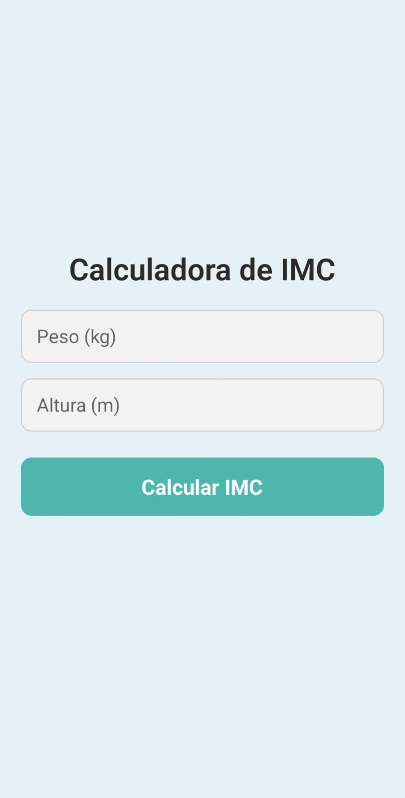
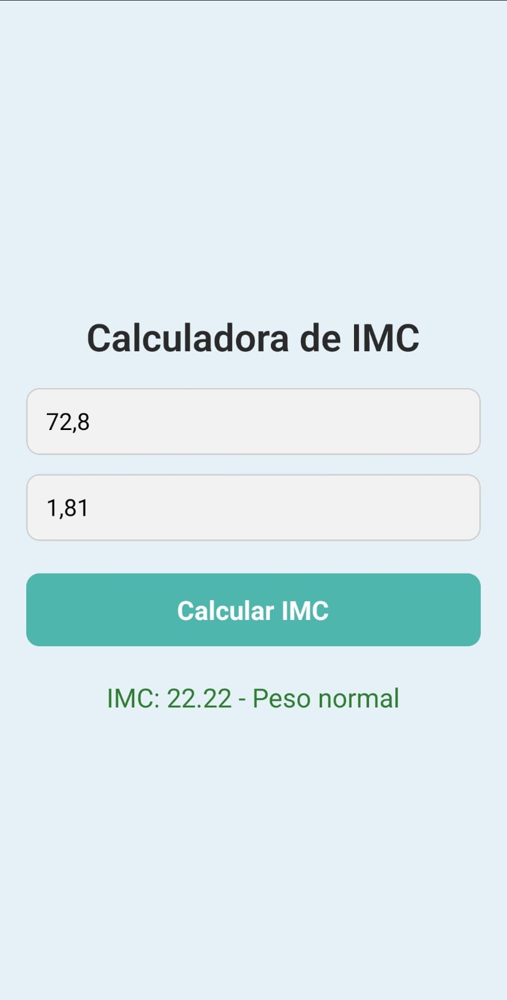
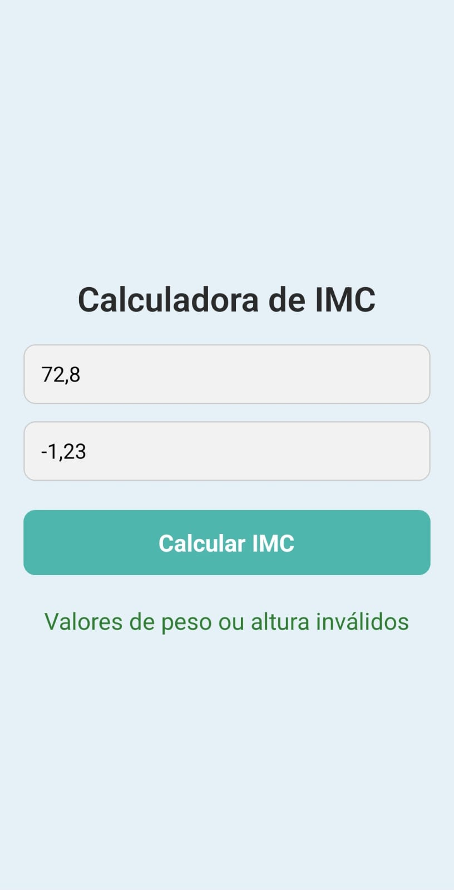

# 📱 Calculadora de IMC (React Native)

Este aplicativo foi desenvolvido em **React Native** e tem como objetivo permitir ao usuário **calcular seu IMC (Índice de Massa Corporal)** com base no peso e altura informados. A interface é simples, responsiva e amigável, voltada para fácil uso em dispositivos móveis.

---

## ✅ Funcionalidades Implementadas

### 🔢 Cálculo de IMC
- O usuário informa seu **peso (em kg)** e **altura (em metros)**.
- Ao clicar em **"Calcular IMC"**, o app calcula o IMC e o exibe abaixo na tela.
 

### 📊 Classificação do IMC
O IMC calculado é classificado conforme a tabela:

| IMC              | Classificação           |
|------------------|--------------------------|
| Abaixo de 18,5   | Abaixo do peso          |
| 18,5 a 24,9      | Peso normal             |
| 25 a 29,9        | Sobrepeso               |
| 30 a 34,9        | Obesidade grau I        |
| 35 a 39,9        | Obesidade grau II       |
| 40 ou mais       | Obesidade grau III      |

### ⚠️ Validação de Dados
- O app **verifica se os valores inseridos são válidos**:
  - Campos obrigatórios
  - Números positivos
  - Nada de letras ou caracteres inválidos
- Em caso de erro, uma **mensagem de aviso é exibida** na tela de resultado.

### 🎨 Interface Responsiva e Amigável
- Design simples e intuitivo
- Campos com espaçamento confortável
- Cores suaves e tipografia clara
- Estilização feita com `StyleSheet` do React Native

---

## 🚀 Tecnologias Utilizadas
- [React Native](https://reactnative.dev/)
- Hooks (`useState`)
- Componentes funcionais
- Estilização com `StyleSheet`

---

## 📷 Captura de Tela
<p align="center">
  
  
  
</p>

---

## 📦 Como Executar o Projeto

1. Clone o repositório:
   ```bash
   git clone https://github.com/gabriel-smartins/Calculadora-IMC.git
   cd Calculadora-IMC
   ```

2. Instale as dependências:
   ```bash
   npm install
   ```

3. Rode o projeto:
   ```bash
   npx react-native run-android
   ```
   ou
   ```bash
   npx expo start
   ```

---


